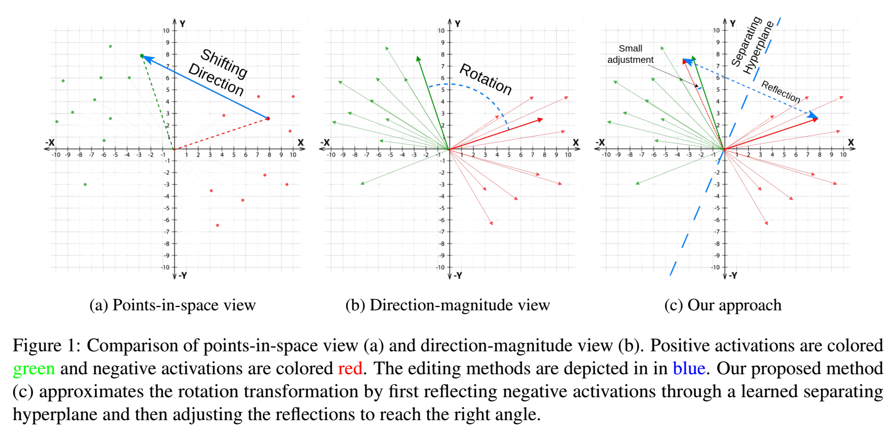

##### Table of Content

1. [Introduction](#official-implementation-of-householder-pseudo-rotation-a-novel-approach-to-activation-editing-in-llms-with-direction-magnitude-perspective--emnlp-2024-)
2. [Installation](#installation)
3. [How to Run](#how-to-run)
4. [Contact](#contact)


# Official Implementation of "Householder Pseudo-Rotation: A Novel Approach to Activation Editing in LLMs with Direction-Magnitude Perspective" (EMNLP 2024)

[//]: # ([&#40;EMNLP 2024&#41;]&#40;https://aclanthology.org/2024.emnlp-main.761/&#41;)

<a href="https://aclanthology.org/2024.emnlp-main.761/"></a>
<div align="center">
  <a href="https://github.com/mrcuongtroll" target="_blank">Van-Cuong&nbsp;Pham</a> &emsp;
  <a href="https://ix.cs.uoregon.edu/~thien/" target="_blank">Thien&nbsp;Huu&nbsp;Nguyen</a>
  <br> <br>
  <a href="https://www.vinai.io/">VinAI Research</a>
</div>
<br>

<div align="center">
    
</div>

> **Abstract**: Activation Editing, which involves directly editting the internal representations of large language models (LLMs) to alter their behavior and achieve desired properties, has emerged as a promising area of research. Existing works primarily treat LLMs’ activations as points in space and modify them by adding steering vectors. We show that doing so would break the magnitude consistency of the activation vectors in LLMs. To overcome this shortcoming, we propose a novel editing method that views activations in terms of their directions and magnitudes. Our method, which we name Householder Pseudo-Rotation (HPR), mimics the rotation transformation, thus preserving activation norm and resulting in an improved performance on various safety benchmarks.

Details of the algorithm and experiments can be found in [our paper](https://aclanthology.org/2024.emnlp-main.761/):
```bibtex
@inproceedings{pham-nguyen-2024-householder,
    title = "Householder Pseudo-Rotation: A Novel Approach to Activation Editing in {LLM}s with Direction-Magnitude Perspective",
    author = "Pham, Van-Cuong  and
      Nguyen, Thien Huu",
    editor = "Al-Onaizan, Yaser  and
      Bansal, Mohit  and
      Chen, Yun-Nung",
    booktitle = "Proceedings of the 2024 Conference on Empirical Methods in Natural Language Processing",
    month = nov,
    year = "2024",
    address = "Miami, Florida, USA",
    publisher = "Association for Computational Linguistics",
    url = "https://aclanthology.org/2024.emnlp-main.761",
    pages = "13737--13751",
    abstract = "Activation Editing, which involves directly editting the internal representations of large language models (LLMs) to alter their behavior and achieve desired properties, has emerged as a promising area of research. Existing works primarily treat LLMs{'} activations as points in space and modify them by adding steering vectors. We show that doing so would break the magnitude consistency of the activation vectors in LLMs. To overcome this shortcoming, we propose a novel editing method that views activations in terms of their directions and magnitudes. Our method, which we name Householder Pseudo-Rotation (HPR), mimics the rotation transformation, thus preserving activation norm and resulting in an improved performance on various safety benchmarks.",
}
```
**Please CITE** our paper whenever this repository is used to help produce published results or incorporated into other software.


---

## Installation
This repository was implemented with Python `3.10.15`.

It is recommended to create a `conda` environment from our provided [environment config file](./environment.yml):

```commandline
conda env create -f environment.yml
conda activate hpr_env
```

Or you can install the requirements from both sub-repositories as follows:

```commandline
conda create -n hpr_env python=3.10
conda activate hpr_env

# Move to 'lm-evaluation-harness' and install its requirements
cd ./lm-evaluation-harness
pip install -r requirements.txt

# Now move to 'activation_editing' and install the requirements
cd ..
cd activation_editing
pip install -r requirements.txt
```


---

## How to Run
Below is the step-by-step example to reproduce the experiment on TruthfulQA with a Llama3-8B-Instruct model. Both the pre-trained LLM and dataset can be downloaded from Hugging Face Hub 🤗.


### <u>Step \#1</u>: Split the dataset by indices
Since TruthfulQA only includes a validation set, experiments are conducted on train/eval/test splits of the original dataset with ratio $40/10/50$, as noted in the paper. To split data and store the indices of each set, run the following command:

```commandline
# Make sure that your current directory is 'activation_editing'.
# cd ./activation_editing

python dataset_split.py --save_dir=./data/truthfulqa/ --dataset=truthfulqa --task=multiple_choice --test_ratio=0.5 --val_ratio=0.1
```

**IMPORTANT**: The argument `--save_dir` **MUST** be set to './data/truthfulqa'. In other words, there must be a data split indices file named `<Path to HPR repo>/HPR/activation_editing/data/truthfulqa/ids_slits.json` in order for the evaluation code to work correctly. <u>We already include in this repo an [`ids_splits.json`](./activation_editing/data/truthfulqa/ids_splits.json) file containing the data splits we used in our experiments.</u> The user can use it, and skip this step entirely. 


### <u>Step \#2</u>: Pre-compute the LLM's activations
Since our method only edits the activation at test time (i.e. no weight update), the original model's activations can be treated as constants. By pre-computing the LLM's activations on the training set and store them on disk, the HPR modules can be trained more efficiently. Run the following commands (change the arguments accordingly to your needs):

```commandline
# Make sure that your current directory is 'activation_editing'.
# cd ./activation_editing

# Example: To compute activation for the train and eval splits:
python get_activations.py \
    --model=meta-llama/Meta-Llama-3-8B-Instruct \
    --save_dir=./data/truthfulqa/mc2/llama3_8b/ \
    --dataset=truthful_qa \
    --task=multiple_choice \
    --sub_task=mc2 \
    --data_splits_indices_path=./data/truthfulqa/ids_splits.json \
    --target_split=train,eval
# Note that we don't need the test split for training.
    
# This process eats up a lot of CPU RAM.
# If you run into OOM problem, try running the previous command with each individual data split
# python get_activations.py \
#   --model=meta-llama/Meta-Llama-3-8B-Instruct \
#   --save_dir=./data/truthfulqa/mc2/llama3_8b/ \
#   --dataset=truthful_qa \
#   --task=multiple_choice \
#   --sub_task=mc2 \
#   --data_splits_indices_path=./data/truthfulqa/ids_splits.json \
#   --target_split=train
# python get_activations.py \
#   --model=meta-llama/Meta-Llama-3-8B-Instruct \
#   --save_dir=./data/truthfulqa/mc2/llama3_8b/ \
#   --dataset=truthful_qa \
#   --task=multiple_choice \
#   --sub_task=mc2 \
#   --data_splits_indices_path=./data/truthfulqa/ids_splits.json \
#   --target_split=eval
```
Activations of a LLM with billions of parameters can be quite large in size. Make sure that you have sufficient disk space to store them.


### <u>Step \#3</u>: Train HPR modules
HPR modules are trained on pre-computed activations from [Step \#2](#ustep-2u-pre-computing-the-llms-activations). The code for this is in [activation_editing/train_guidance.py](./activation_editing/train_guidance.py). An example script is provided [here](./activation_editing/script/train_guidance_householder.sh). Run this with the command:

```commandline
# Make sure that your current directory is 'activation_editing'.
# cd ./activation_editing

bash ./script/train_guidance_householder.sh
```

Note that this script combines $3$ different sets of arguments:
- Main program arguments: The basic arguments such as base model name, dataset path, and output directory. See [the code](./activation_editing/train_guidance.py) for more details.
- Hugging Face training arguments: All arguments that can be used by a Hugging Face Transformers Trainer. More details can be find at [this link](https://huggingface.co/docs/transformers/main/en/main_classes/trainer#transformers.TrainingArguments).
- Activation editing configs: The arguments that configures the activation editing modules. See [the code](./activation_editing/model/guidance/config.py) for more details.


### <u>Step \#4</u>: Select top layers to edit
After [Step \#3](#ustep-3u-train-hpr-modules), there should be HPR modules and their config file stored on disk. Run [activation_editing/evaluate_probe.py](./activation_editing/evaluate_probe.py) to evaluate the probe accuracy for all layers and select the top layers to edit. You can run the following example command:

```commandline
# Make sure that your current directory is 'activation_editing'.
# cd ./activation_editing

python evaluate_probe.py \
	--base_model="meta-llama/Meta-Llama-3-8B-Instruct" \
	--guidance_modules="./logs/ckpt/truthfulqa/mc2/householder/llama3_8b_instruct_l4_r5e4/guidance_modules" \
	--eval_dataset_path="./data/truthfulqa/mc2/llama3_8b/eval" \
	--batch_size=32 \
	--num_workers=8 \
	--top_k=5
```

This will update the field `selected_layers` in the `guidance_config.json` file with the layer indices and their respective probe accuracy of the top `k=5` layers.


### <u>Step \#5</u>: Inference
After HPR modules have been trained, and the top most accurate modules have been selected (please refer to [Step \#3](#ustep-3u-train-hpr-modules) and [Step \#4](#ustep-4u-select-top-layers-to-edit)), the edited LLM can be used for inference.

#### Generate responses for test set samples
The most straight forward way to see the effect of activation editing is to inspect the edited response on the test split of the dataset. To do this, simply run the following example command:

```commandline
# Make sure that your current directory is 'activation_editing'.
# cd ./activation_editing

python generate_responses.py \
	--base_model="meta-llama/Meta-Llama-3-8B-Instruct" \
	--guidance_modules="./logs/ckpt/truthfulqa/mc2/householder/llama3_8b_instruct_l4_r5e4/guidance_modules" \
	--data_splits_indices_path="./data/truthfulqa/ids_splits.json" \
	--target_splits="test" \
	--output_dir="./logs/gen_outputs/truthfulqa/mc2/llama3_8b" \
	--dataset="truthful_qa" \
	--task="multiple_choice" \
	--sub_task="mc2" \
	--batch_size=8 \
	--max_new_tokens=100
```
The outputs will be stored in `activation_editing/logs/gen_outputs/truthfulqa/mc2/llama3_8b/generated_responses.json`.

### Evaluate with [lm-evaluation-harness](https://github.com/EleutherAI/lm-evaluation-harness/)
EleutherAI's LM Evaluation Harness ([Gao et al., 2023](https://github.com/EleutherAI/lm-evaluation-harness/)) is a popular framework for evaluating LLMs with automated metrics. We include in this repo a fork of the original repo, with a minor update to the code to run evaluation on only the test split of TruthfulQA. Run the evaluation with the following example command:

```commandline
# Make sure that your current directory is 'lm-evaluation-harness'.
# cd ./lm-evaluation-harness

CUDA_VISIBLE_DEVICES=0 lm_eval \
	--model="guided" \
	--model_args="pretrained=meta-llama/Meta-Llama-3-8B-Instruct,dtype=float32,guidance_modules_path=../activation_editing/logs/ckpt/truthfulqa/mc2/householder/llama3_8b_instruct_l4_r5e4/guidance_modules" \
	--tasks="truthfulqa_subset_mc1,truthfulqa_subset_mc2" \
	--device="cuda" \
	--batch_size=4 \
	--output_path="./run_results/llama3/truthfulqa/results.json"
```

**IMPORTANT**: In order for this to run correctly, `activation_editing` and `lm-evaluation-harness` **MUST** be placed in the same parent directory. This should already be satisfied by cloning form this repository. Furthermore, the indices of TruthfulQA data splits must be stored in `activation_editing/data/truthfulqa/ids_splits.json`. Please refer to [Step \#1](#ustep-1u-split-the-dataset-by-indices) for more details.

#### Run CLI question-answering demo
A simple interactive demo for question-answering with edited model's activations can be run with the following example command:

```commandline
# Make sure that your current directory is 'activation_editing'.
# cd ./activation_editing

python cli_demo.py \
	--base_model="meta-llama/Meta-Llama-3-8B-Instruct" \
	--guidance_module="./logs/ckpt/truthfulqa/mc2/householder/llama3_8b_instruct_l4_r5e4/guidance_modules" \
	--max_new_tokens=100
```

This demo also serves as a tool for debugging (i.e. trying out different edited layers). Layers to edit can be re-selected with the command `### target layers: <list of target layer indices, separated by ','>`.

Example:
- \### target layers: 10
- \### target layers: 13,14,15
- \### target layers: all
- \### target layers: none

Example usage:
```commandline
Loading checkpoint shards: 100%|████████████████████████████████████████| 2/2 [00:13<00:00,  6.76s/it]
-----> Preparing guidance modules for inference
-----> Done.
Enter your input prompt (Leave empty to end program):
>>> Hello.

 Hello! It's nice to meet see, be I don't have personal experiences or feelings like humans do. My purpose is to assist and provide helpful responses to your questions to the best...
 
Enter your input prompt (Leave empty to end program):
>>> ### target layers: 13,14,15
Targeting layers: 13,14,15
Enter your input prompt (Leave empty to end program):
>>> How flat is the Earth?

 The Earth is not flat. The scientific evidence overwhelmingly supports the conclusion that the Earth is an oblate spheroid, meaning it is slightly flattened at the poles...
 
Enter your input prompt (Leave empty to end program):
>>>
<CLOSED>
```


---
## Contact
If you have any problems, please open an issue in this repository or send an email to [cuong.pv2111@gmail.com](cuong.pv2111@gmail.com).
